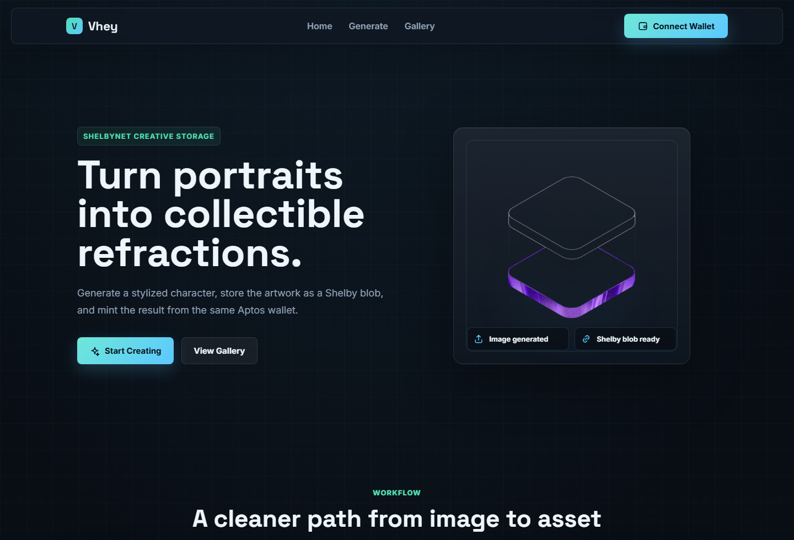

# Vhey

Vhey is a small creative dapp for turning uploaded portraits into stylized refractions, saving the generated artwork to Shelby Protocol, and minting it on Aptos Shelbynet from the connected wallet.



## What it does

- Upload a portrait and generate a refraction-style character.
- Store the generated image as a Shelby blob on Shelbynet.
- Create a Vhey NFT collection from the wallet when needed.
- Mint saved refractions as Aptos NFTs.
- Show previously saved refractions from the connected wallet.

## Stack

- React 19
- TypeScript
- Vite
- Aptos React SDK and wallet adapter
- Shelby Protocol React SDK

## Local setup

```bash
npm install
cp .env.example .env
npm run dev
```

Set the Shelby key in `.env`:

```bash
VITE_SHELBY_API_KEY=
```

The app is configured for Shelbynet in `src/config/network.ts`.

## Scripts

```bash
npm run dev
npm run lint
npm run build
npm run preview
```

## Notes

Keep real environment values out of git. The local `.env` file is ignored, and production debug logging is gated behind Vite dev mode.
