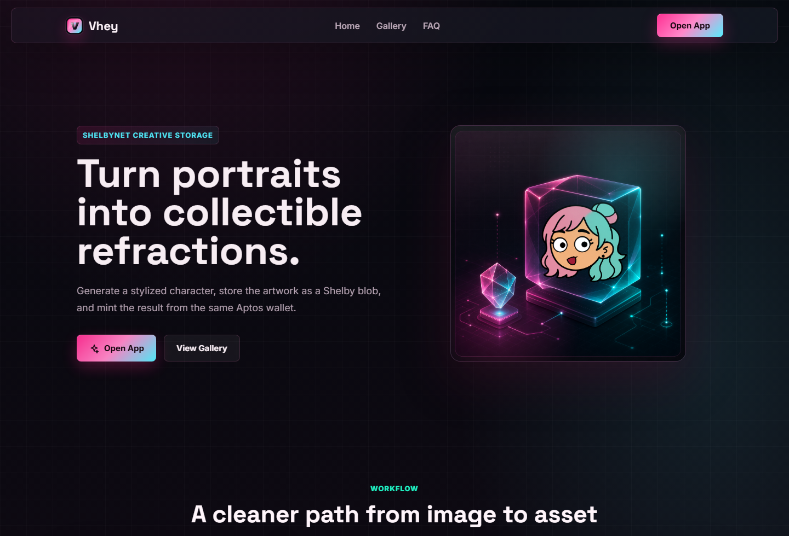
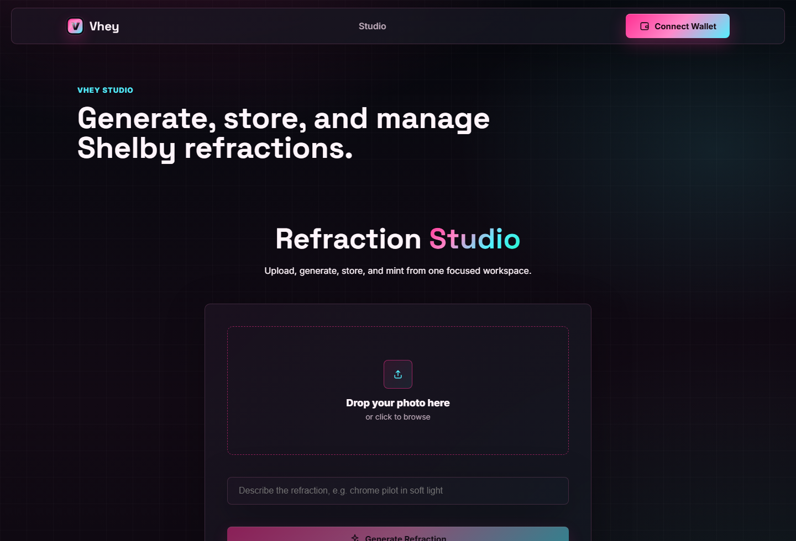

# Vhey

Vhey is a creative dapp on Shelbynet for turning portrait uploads into refraction-style artwork, storing the result with Shelby Protocol, and keeping a simple proof trail for each saved piece.

The project started as a small AI doodle experiment. It is now moving toward a verifiable media flow where the generated artwork, metadata, wallet, timestamp, and content hash are tied back to decentralized storage.





## Current Features

- Separate landing page and app studio.
- Portrait upload and doodle/refraction generation.
- Shelby blob upload on Shelbynet.
- Proof metadata JSON stored alongside the artwork.
- Proof Card with creator, timestamp, model, and SHA-256 hash.
- Shareable proof route at `/proof/:id`.
- My Refractions page for connected wallets.
- Shelby blob delete action for saved refractions.
- Optional Aptos NFT collection creation and mint flow.
- Shelby-inspired dark interface with hot pink, cyan, teal, and violet accents.

## How It Works

1. Open the app studio at `/app`.
2. Connect an Aptos wallet on Shelbynet.
3. Upload an image and generate a refraction.
4. Save the generated artwork to Shelby.
5. Vhey stores both the artwork blob and a metadata blob.
6. The app shows a Proof Card and links to Shelby Explorer.
7. Saved image blobs appear in My Refractions, where they can be viewed or deleted.

## Stack

- React 19
- TypeScript
- Vite
- TanStack Query
- Aptos TypeScript SDK
- Aptos React SDK
- Aptos Wallet Adapter
- Shelby Protocol React SDK
- Shelby Protocol TypeScript SDK

## Local Setup

```bash
npm install
cp .env.example .env
npm run dev
```

Set the Shelby key in `.env`:

```bash
VITE_SHELBY_API_KEY=
```

The network config is in:

```text
src/config/network.ts
```

For Vercel deployments, `vercel.json` includes a single-page app rewrite so direct links such as `/app` and `/proof/:id` resolve correctly.

## Scripts

```bash
npm run dev
npm run lint
npm run build
npm run preview
```

## Routes

```text
/          landing page
/app       studio and wallet app
/proof/:id proof page
```

## Notes

The current generator uses a lightweight doodle-style flow. The next planned upgrade is an image-to-image API behind a backend key, so generated artwork can better match uploaded portraits without exposing private API keys in the frontend.

Keep real environment values out of git. `.env` is ignored.
